# T1A2-web-portfolio

## Overview
Website link: https://vanngportfolio.netlify.app/

This is a portfolio website with a mininmalistic design to showcase myself of who I am and what I kind of services/skills I can provide. This is currently under development. We will keep adding features in readme that we have added in the website.

## Target Audience
The target audience for the portfolio website is an employer looking to engage a dev and/or IT professional. Expect the employer to have the following knowledge and expectations:

* technical knowledge relating to information technology, software development/coding, programming languages and development stacks

* high expectations of professionalism and a positive work ethic

## Tech stack
The following tech stacks used for this website is: HTML, CSS, & Figma. 

## Site Map
This is a site map briefly showing the navigations to each page starting from the Home Page to either About, Works & Contact pages. In addition each page consists of a footer that navigates to other external pages such as social media, button links to download files and a button to submit a form.

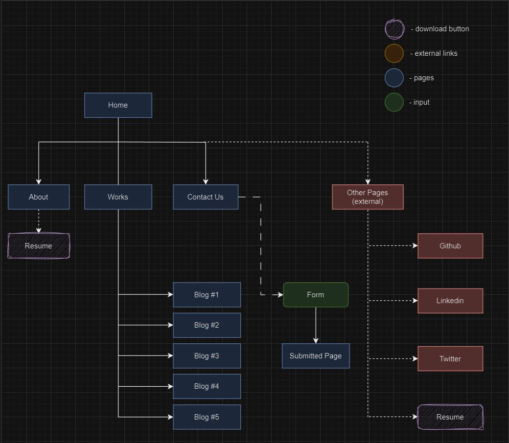

## Wireframes
This wireframe is a low to mid fidelity wireframe showcasing each page; Home Page, About, Works, Contact, Submission page and blog page(s) - total of 5 blog pages and other components. The wireframes below will show different sizes to a responsive web design for mobile, tablet and desktop.

Each page for each wireframe layout consists of images and text.

### Mobile 
This is a wireframe for mobile users. The template uses a width of 360px.

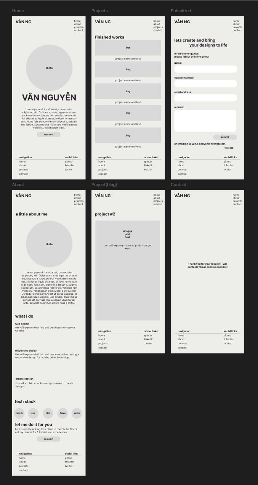

### Tablet
This is a wireframe for tablet users. The template uses a width of 834px.
From this template onwards, it will create a left-right padding to center content on page.
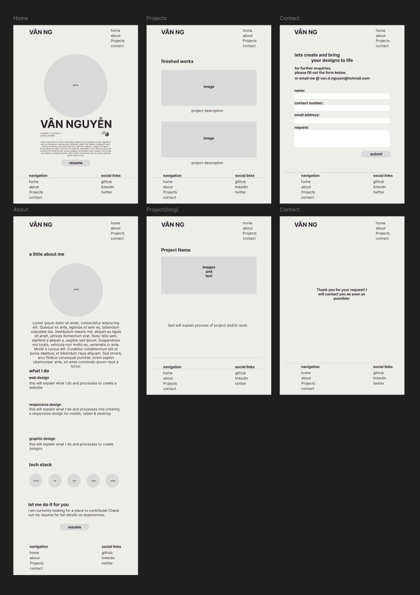

### Desktop
This is a wireframe for desktop users. The template uses a width of 1440px.
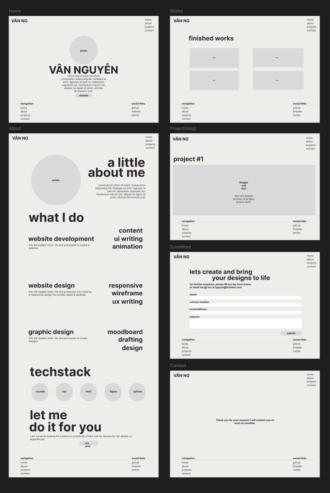

## Fonts
The fonts used for the website is copyright free from FontShare. https://www.fontshare.com

### Cabinet Grotesk - https://www.fontshare.com/fonts/cabinet-grotesk
This font will be used mostly for headers.

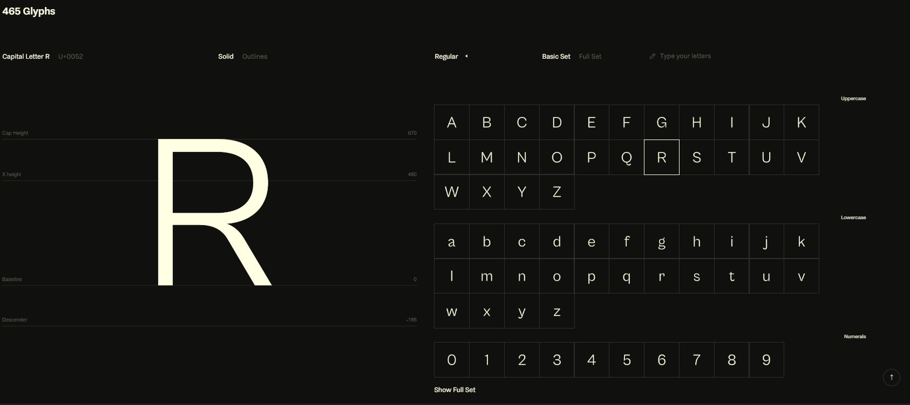
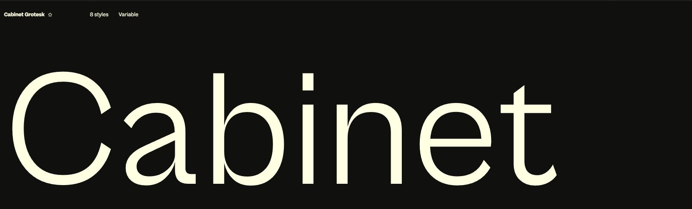

### Satoshi - https://www.fontshare.com/fonts/satoshi
This font will be used for content texts/paragraphs.

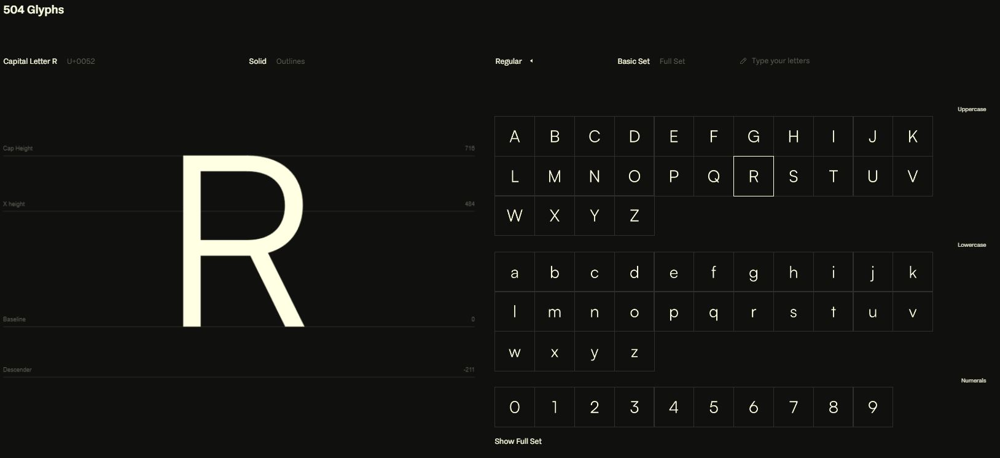
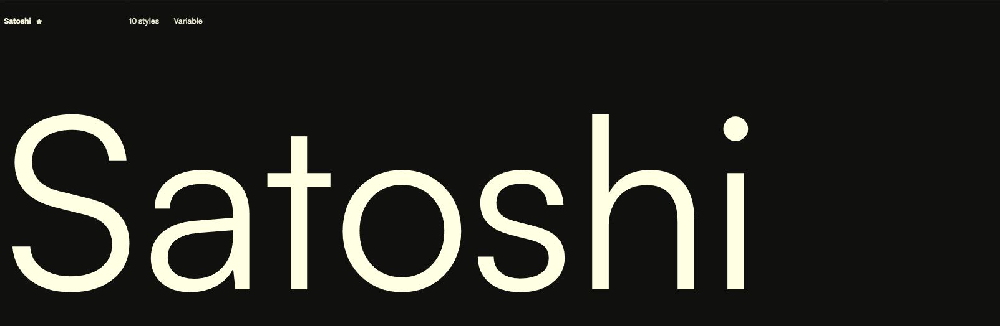

## Main Components
These will be implemented in each page of the website which includes a visual icon for the browser. 

###### Visual icon
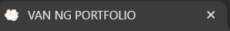

### Header
The header component has a logo(name) for my portfolio along with a navigation bar. The navigation bar has items linked to navigate to different pages: Home, About, Works & Contact. The logo is also a hyperlink to navigate to the home page.

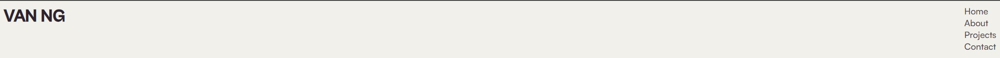

###### hovering over hyperlinks will change color
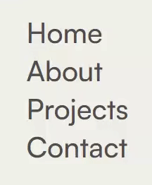

### Footer
The footer component has a second navigation bar to allow users to navigate if they were to scroll to the bottom of the page & links to social media such as; Github, Linkedin & Twitter. (external links will open up a new tab)

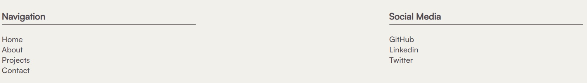

### Main
This is the main body which includes the main content of each page.
e.g. about page will contain images and text describing information of myself, techstacks, skills and resume.

#### Home Page
The Home Page consists of a portrait image of myself with a brief description of what I am & what I do. In addition, there is an implementation of other graphical icons and a button link to download a PDF file of my resume.

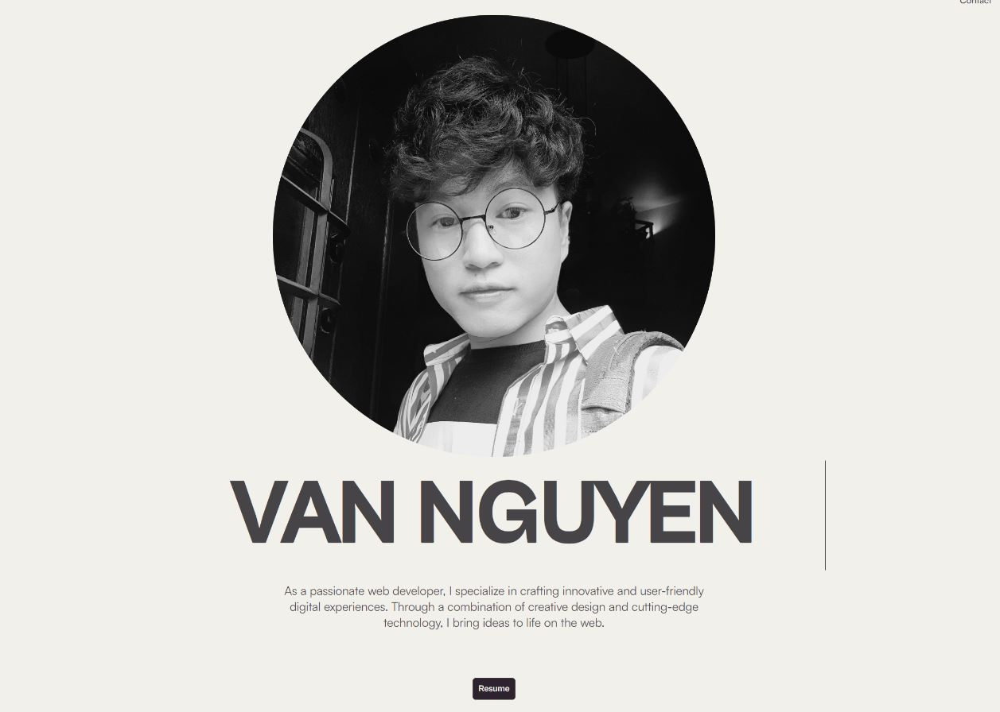

###### click resume button to download pdf file
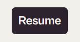

###### Animation
Added a typewriter effect to my full name to give it more immersion and motion to the website.
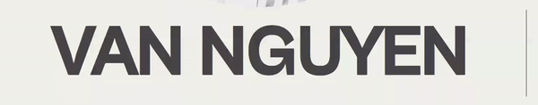

### About Page
The About Page further includes a description of where I am based at, what I am, my skills and also my ideals & goals. This page includes:

- Portrait of myself
- What I do; web design, web development and graphic design
- List of TechStacks used for web development
- Before the footer, another link/button to allow users to download my resume if they wish to view further into my work/education history.

### Projects Page
This page consist of a list of projects that I have worked on (tentative placeholders). Users can view a brief visual and infographic on this page. By clicking on the 'read more' link on the a project, it will direct them to the specific project page for more information as a blog.

credit images to:
- https://webflow.com/blog/parallax-scrolling 
- https://www.invisionapp.com/inside-design/10-examples-of-parallax-scrolling/
- https://mockuuups.studio/blog/post/best-bento-grid-design-examples/
- last 2 projects are my personal projects using python and 3D animation programs such as Maya.

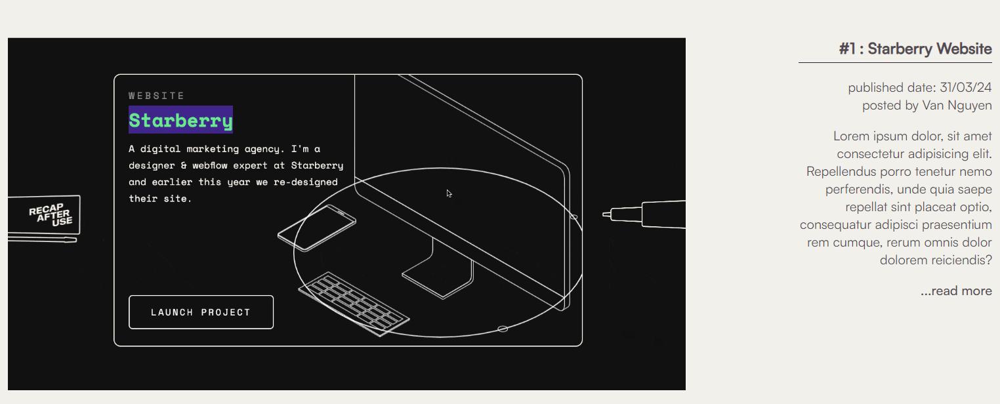

###### click readmore to direct to project/blog page
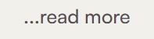

#### > Project(Blog) Page
This page consist of a more detailed overview of the selected project that the user has entered.
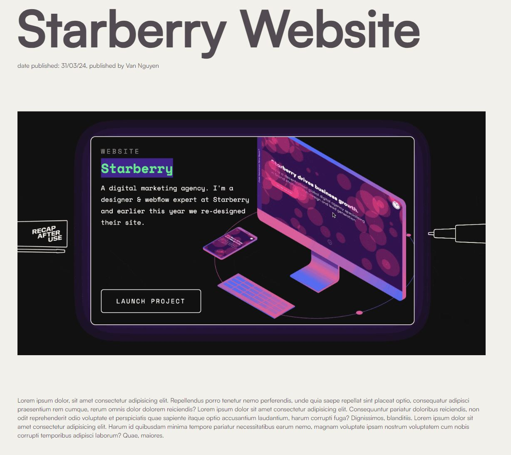

### Contact Page
This page consist of a header, information for users to complete a form with email address alternative. The email address displayed on the page is also clickable to open the user's primary email program such as Outlook.

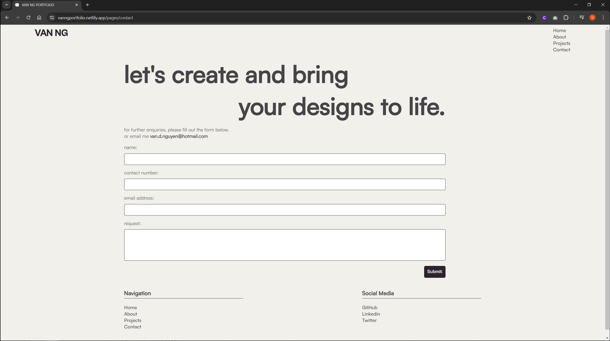

###### click here to open up primary email program
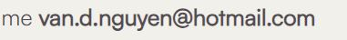

###### form to submit a request/enquiry + submit button to submit request
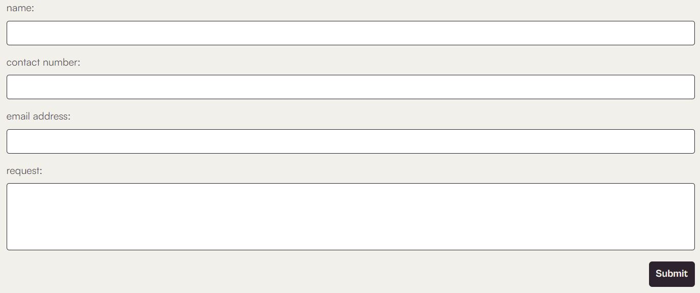!

###### click submit button to submit request
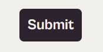

#### > Submitted Page
By clicking the 'submit' button on the contact page, it will direct user's to this page notifying the user that their submission has been processed.
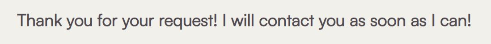